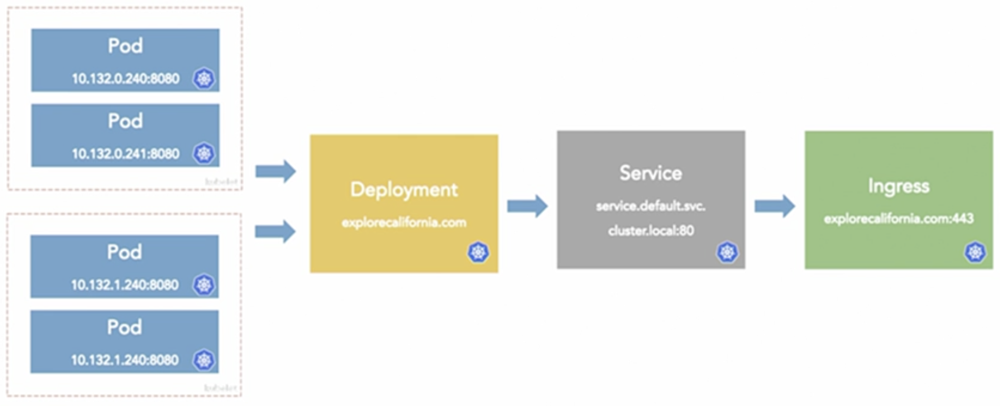

# Kubernetes-First-Project

## Arquitetura da Solução


## Download Kind
Baixar o Kind para MacOS (com chip ARM64):

```bash
curl --location --output ./kind https://github.com/kubernetes-sigs/kind/releases/download/v0.11.1/kind-darwin-arm64
```

Deixar o binário do Kind executável:

```bash
chmod +x ./kind
```

## Criar Docker Image
```bash
docker build -t explorecalifornia.com .
docker run --rm --name explorecalifornia.com -p 5000:80 -d explorecalifornia.com
```

## Criar Cluster Kubernetes
Criar o cluster com o Kind usando a configuração fornecida:

```bash
./kind create cluster --name explorecalifornia.com --config ./kind_config.yaml
```

Aplicar o ConfigMap:

```bash
kubectl apply -f ./kind_configmap.yaml
```

## Docker Registry Local
Iniciar o Docker Registry local:

```bash
docker run --name local-registry -d --restart=always -p 5000:5000 registry:2
```

Taguear a imagem e empurrar para o registro local:

```bash
docker tag explorecalifornia.com 127.0.0.1:5000/explorecalifornia.com
docker push 127.0.0.1:5000/explorecalifornia.com
```

Validar o registro:

```bash
curl --location http://127.0.0.1:5000/v2/_catalog
```

Conectar o registro local à rede do Kind:

```bash
docker network connect kind local-registry
```

## Criar Deployment Kubernetes
Criar o deployment com o comando `dry-run` e gerar o arquivo `deployment.yaml`:

```bash
kubectl create deployment --dry-run=client --image 127.0.0.1:5000/explorecalifornia.com explorecalifornia.com --output=yaml > deployment.yaml
```

Aplicar o deployment:

```bash
kubectl apply -f deployment.yaml
```

Verificar se o pod foi criado:

```bash
kubectl get pods -l app=explorecalifornia.com
```

Fazer o port-forward para acessar a aplicação na porta 8080:

```bash
kubectl port-forward deployment/explorecalifornia.com 8080:80
```

A aplicação deve estar acessível na porta 8080.

## Criar Service Kubernetes
Criar o serviço ClusterIP com o comando `dry-run` e gerar o arquivo `service.yaml`:

```bash
kubectl create service clusterip --dry-run=client --tcp=80:80 explorecalifornia.com --output=yaml > service.yaml
```

Editar o arquivo `service.yaml` e modificar o campo `metadata.name` para `explorecalifornia-svc`.

Aplicar o serviço:

```bash
kubectl apply -f service.yaml
```

Verificar todos os recursos relacionados:

```bash
kubectl get all -l app=explorecalifornia.com
```

Fazer o port-forward para acessar a aplicação na porta 8080:

```markdown
kubectl port-forward service/explorecalifornia-svc 8080:80
```

A aplicação deve estar acessível na porta 8080.

## Criar Ingress Kubernetes
Criar o Ingress com o comando `dry-run` e gerar o arquivo `ingress.yaml`:

```bash
kubectl create ingress explorecalifornia.com --rule="explorecalifornia.com/=explorecalifornia-svc:80" --dry-run=client --output=yaml > ingress.yaml
```

Editar o arquivo `ingress.yaml`:

- Modificar o campo `pathType` para `Prefix`.
- Retirar o objeto `status.loadbalancer`.

Descomentar as linhas comentadas em `kind_config.yaml` e reexecutar o comando para criar o cluster, apenas para validar se está tudo correto.

Recriar o cluster (se necessário):

```bash
./kind create cluster --name explorecalifornia.com --config ./kind_config.yaml
```

### Configurar Ingress Controller
Aplicar a configuração do Ingress Controller:

```bash
kubectl apply -f https://raw.githubusercontent.com/kubernetes/ingress-nginx/main/deploy/static/provider/kind/deploy.yaml
```

Validar se o Ingress Controller foi aplicado corretamente:

```bash
kubectl get all -n ingress-nginx
```

#### Configurar host
Adicionar o host no arquivo `/etc/hosts`:

```bash
sudo vim /etc/hosts
```

Adicionar a linha:

```text
127.0.0.1 explorecalifornia.com
```

Aplicar novamente o arquivo `ingress.yaml`:

```bash
kubectl apply -f ingress.yaml
```

Verificar se o Ingress está funcionando corretamente:

```bash
curl http://explorecalifornia.com
```

## Outros comandos pertinentes do Kubernetes
- Escalar o deployment para 5 réplicas:

    ```bash
    kubectl scale deployment explorecalifornia.com --replicas=5
    ```

- Verificar nós no cluster:

    ```bash
    kubectl get nodes
    ```

- Verificar pods no namespace `kube-system`:

    ```bash
    kubectl get pods --namespace kube-system
    ```

- Verificar clusters do KIND:

    ```bash
    ./kind get clusters
    ```

- Deletar o cluster:

    ```bash
    ./kind delete cluster --name explorecalifornia.com
    ```

- Remover o Docker Registry local:

    ```bash
    docker rm local-registry
    ```